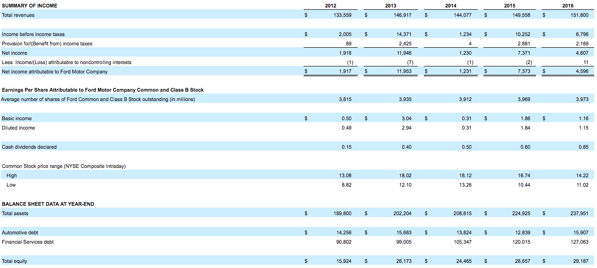

=======
tenform
=======

.. image:: https://img.shields.io/pypi/v/tenform.svg
        :target: https://pypi.python.org/pypi/tenform

.. image:: https://travis-ci.com/tyfal/tenform.svg
        :target: https://travis-ci.com/tyfal/tenform

.. image:: https://readthedocs.org/projects/tenform/badge/?version=latest
        :target: https://tenform.readthedocs.io/en/latest/?badge=latest
        :alt: Documentation Status

Python package that utilizes requests and regex to make digging through the SEC database and analyzing 10 forms easy.

Usage
-----

.. code:: python

    >>> from tenform.tenform import stock
    >>> import pandas as pd
    >>> import os, webbrowser

    >>> s = stock('F')
    >>> print(s.get_ticker)
    <bound method stock.get_ticker of <Stock F>>

    >>> l = s.tenk_links('2016-01-01','2018-01-01')
    >>> print(l[0])
    https://www.sec.gov/Archives/edgar/data/37996/000003799617000013/f1231201610-k.htm

    >>> IncStmt = s.tenk_IS('2017-01-01', '2018-01-01')
    >>> path = os.path.abspath('temp.html')
    >>> url = 'file://' + path
    >>> with open(path, 'w') as f:
    >>>   f.write(IncStmt)
    >>> webbrowser.open(url)
    >>> os.remove('temp.html')

Functions
---------

* stock(*ticker*)
* tenk_links(*start_date='YYYY-MM-DD', end_date='YYYY-MM-DD'*)
* tenk_IS(*start_date='YYYY-MM-DD', end_date='YYYY-MM-DD'*)
* tenq_links(*start_date='YYYY-MM-DD', end_date='YYYY-MM-DD'*)
* tenq_IS(*start_date='YYYY-MM-DD', end_date='YYYY-MM-DD'*)

License
-------
* Free software: MIT license
* Documentation: https://tenform.readthedocs.io.

Credits
-------

This package was created with Cookiecutter_ and the `audreyr/cookiecutter-pypackage`_ project template.

.. _Cookiecutter: https://github.com/audreyr/cookiecutter
.. _`audreyr/cookiecutter-pypackage`: https://github.com/audreyr/cookiecutter-pypackage
